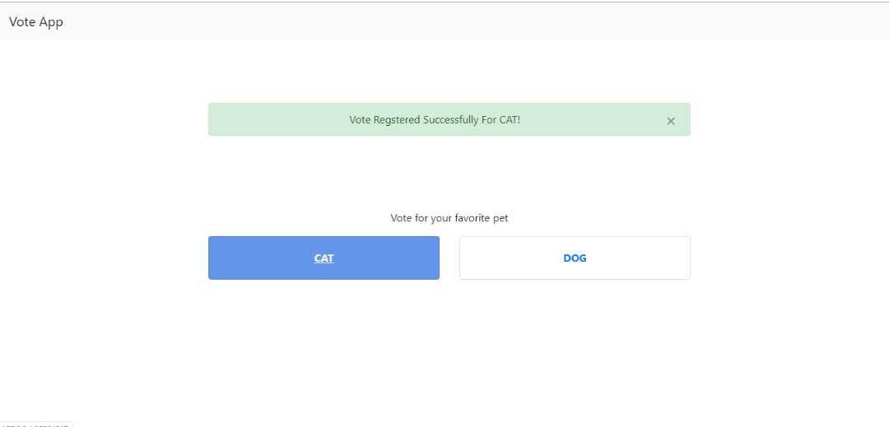
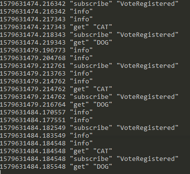
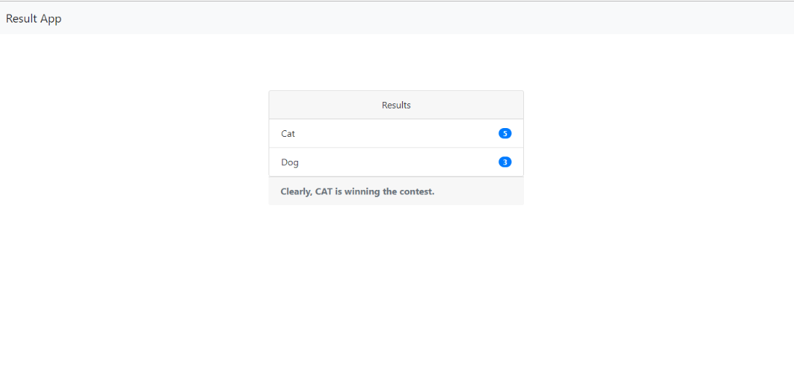

# Voting App
Voting App is a sample application which demonstrates the use of **Redis** as a communication medium for two different applications.
The project has two different modules, built with two different technologies and they have their own functionalities but share the data among themselves using **publish/subscribe** messaging paradigm of **Redis**.

***

### Modules Overview
Following are two modules that has been built under this project:

* voteapp - Built using [Django] framework.
* resultapp - Built using [NodeJS].

The **voteapp** is basically a web app to select your favorite pet! Yes, you read it right. :smile: The idea is simple and fun to implement. There are two options to select, either 'Dog' or 'Cat' as your favorite pet. Once you make a selection, the vote is registered in the in-memory cache using Redis and **publish** event is broadcasted over the channel so that the subscriber(s) can consume the broadcast message.

Whereas, the **resultapp** is a web app built to show the results of the voting in the real-time and display the results of the vote as who is winning over whom. :smiley: This NodeJS application has **subscriber** which listens to the broadcast event of **voteapp** and upon receiving a message, it looks for the total number of votes for that particular pet in the in-memory cache and displays it on the UI. Also, to be specific, the application has a RESTful API which is basically acting as a **subscriber**, which has been used in the application to display the result in real-time. This extends the capability of **subscriber** to be used in other places as it is not tightly bound to the application itself and can be integrated in some other fun app (looking for the same results).

So, overall it's a fun application while demonstrating the communication of two different applications via **Redis**.

***

### Tech Stack

#### voteapp
* [Python]
* [Django]
* [RedisPackage]

#### resultapp
* [NodeJS]
* [Express]
* [RedisClient]

#### Redis Server
* [Redis]

*Please note that I've downloaded the executable Redis Server from [here]. If you are using Windows, then visit the page and download the appropriate zip file. After extracting the zip, you can find two folders: **32bit** and **64bit**. As per your system architecture, cd into that particular folder and you can run the server and client from there. For non-Windows environment, please find the relevant installation instructions and set it up accordingly.*

***

### Running The Applications

In order to see the application in action, first setup **Redis** in your machine, and start the server. Additionally, you can start the client also, to see what is exactly happening when the applications are interacting with Redis server. In order to do so, start the Redis client and run `MONITOR` command to watch the broadcast and subscription messages.

Now, to run each of the applications, first clone the project into a desired location/workspace in your machine and  follow the instructions given below:

#### voteapp
* Enter the *voteapp* directory using:
    `cd voteapp`
* As the folder contains a Pipfile, you can intall the dependencies using 
    `pipenv install`
  Please ensure that *pipenv* is already installed in your development environment.
* Activate the environment using:
    `pipenv shell`
* Again, enter the root project *voteapp* within the existing directory using 
    `cd voteapp`
* Run the following command to start the dev server and visit the url that will popup in the shell:
    `python manage.py runserver`

#### resultapp
* Enter the *resultapp* directory using:
    `cd resultapp`
* Install the depedencies of the project using:
    `npm i`
* While developing the application, for ease of testing the functionality **nodemon** was installed globally and has been added into the scripts so that we don't have to re-run the server again and again. Please ensure that, you've installed **nodemon** globally in your dev enviroment. Once you ensure the **nodemon** is installed, run the following command to start the dev server:
    `npm start`
* After that, the localhost url will popup in the shell and you can visit to see the result application displaying the vote results.

### Results

Once you start the **voteapp**, you can see something as follows:

When you cast the vote in **voteapp**, you can see the broadcast message in the Redis client (proovided that, **MONITOR** command is already running there), something like this:

So, everything is set, then what are you waiting for? Head over to the **resultapp** and see the real-time voting results.

And *Voila!*, the fully integrated application, communicating over Redis is in action. :+1:

***

[//]: #
   [Python]: <https://www.python.org/>
   [Django]: <https://www.djangoproject.com/>
   [NodeJS]: <https://nodejs.org/en/>
   [Express]: <https://expressjs.com/>
   [Redis]: <https://redis.io/>
   [RedisPackage]: <https://pypi.org/project/redis/>
   [RedisClient]: <https://www.npmjs.com/package/redis>
   [here]: <https://github.com/dmajkic/redis/downloads>
